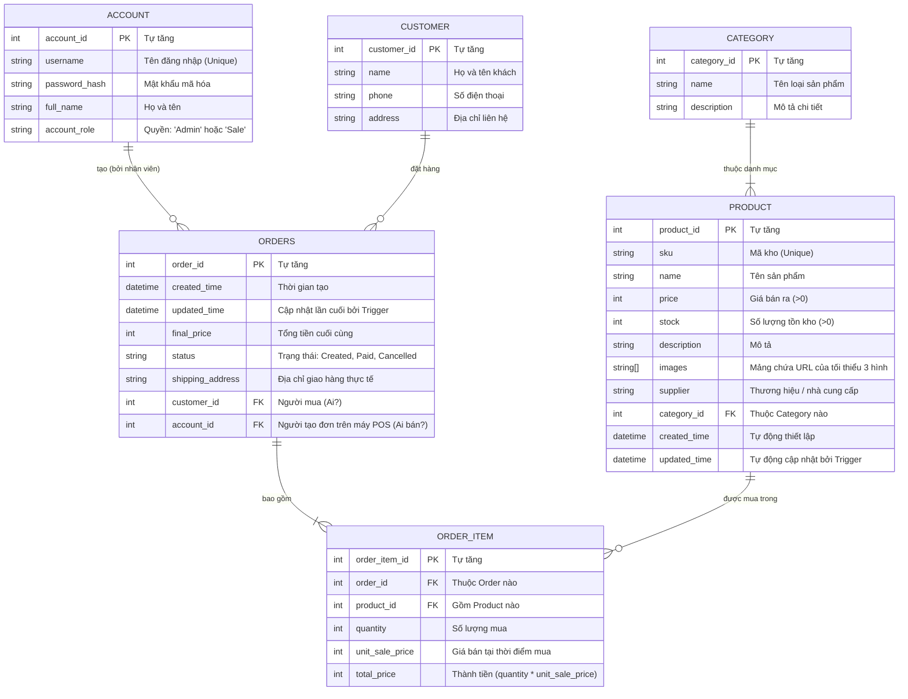

# Kiến trúc Backend MyShop (Node.js + GraphQL + Postgres)

Tài liệu này giải thích cấu trúc thư mục, kiến trúc dự án và sơ đồ cơ sở dữ liệu của phần Backend hệ thống MyShop để cả nhóm cùng theo dõi và phát triển.

---

## 1. Cấu trúc thư mục
Hệ thống sử dụng kiến trúc chuẩn cho Node.js REST/GraphQL kết hợp với CSDL SQL. Chúng ta tách bạch giữa _Lớp giao tiếp (GraphQL)_, _Lớp xử lý dữ liệu (Models)_ và _Lớp lưu trữ (Postgres)_.

```text
backend/
├── database/                   # Chứa các tập tin SQL khởi tạo CSDL
│   ├── migrations/             # Các script tạo cấu trúc bảng, trigger
│   │   └── 01_init_schema.sql  # Định nghĩa khung CSDL chính
│   └── seeds/                  # Các script chèn dữ liệu mẫu (Dummy data)
│       └── 01_dummy_data.sql   # Nạp sẵn tài khoản Admin, Sale và Sản phẩm
├── src/                        # Mã nguồn chính của ứng dụng
│   ├── config/                 # Cấu hình tĩnh và kết nối
│   │   └── db.js               # Thiết lập kết nối đến PostgreSQL (Pool)
│   ├── graphql/                # Lớp giao tiếp API với Frontend bằng GraphQL
│   │   ├── schema/             # Chứa các file schema chia nhỏ (.js xuất mảng chuỗi)
│   │   │   ├── accountSchema.js
│   │   │   ├── productSchema.js
│   │   │   └── orderSchema.js
│   │   ├── resolvers/          # Chứa các file chia nhỏ định tuyến request tới Models
│   │   │   ├── accountResolver.js
│   │   │   ├── productResolver.js
│   │   │   └── orderResolver.js
│   │   ├── loaders/            # Nơi dùng để tối ưu truy vấn CSDL (Batching)
│   │   └── index.js            # Nơi tự động quét và gom tất cả schema/resolvers lại thành 1 cục
│   ├── middleware/             # Xử lý trung gian (Kiểm tra token đăng nhập, báo lỗi)
│   ├── repositories/           # Lớp tương tác CSDL trực tiếp (Tách biệt khỏi GraphQL)
│   │   └── (ví dụ) ProductRepository.js # Chứa hàm getProducts(), createProduct(),...
│   ├── services/               # Lớp xử lý logic nghiệp vụ
│   │   └── (ví dụ) ProductService.js # Chứa hàm getProducts(), createProduct(),...
│   ├── scripts/                # Kịch bản dòng lệnh hỗ trợ dev
│   │   └── initDb.js           # Định dạng lại DB tự động từ thư mục database/
│   ├── utils/                  # Các hàm tiện ích dùng chung
│   │   └── cache.js            # Chứa hàm getCache(), setCache(), delCache(),...
│   ├── routes/                 # Các route cho REST API
│   │   └── upload.routes.js    # Các route cho upload file
│   ├── app.js                  # Khởi tạo khung Express và middlewares cơ bản
│   └── server.js               # Entry point: Cột sống kết nối Express và Apollo Server
├── docker-compose.yml          # File hệ thống giúp chạy cả Node và Postgres chỉ bằng 1 lệnh
├── Dockerfile                  # Quy trình đóng gói mã Node.js để chạy được trên Máy ảo/Cloud
├── package.json                # Quản lý thư viện NPM (express, pg, apollo,...)
└── requirements.md             # Đề cương yêu cầu gốc của đồ án
```

---

## 2. Kết nối Database (Cách hoạt động)

Hệ thống được thiết kế chạy qua **Docker** giúp nhóm không phải cài từng phần mềm rườm rà.
- `docker-compose.yml` định nghĩa 2 services: **`db`** (chạy PostgreSQL) và **`backend`** (chạy code Node.js của chúng ta).
- Backend (Node.js) kết nối với Database (Postgres) thông qua **`src/config/db.js`**. File này sử dụng thư viện `pg` tạo ra một `Pool`. Lợi ích của Pool là giữ cho nhiều truy vấn chạy song song cùng lúc mà không làm sập Database.
- Khi khởi tạo môi trường lần đầu, bất kì ai trong nhóm chỉ cần gõ `npm run db:init` -> Chức năng này sẽ gọi `initDb.js` để đẩy các lệnh SQL ở thư mục `migrations` và `seeds` xuống thẳng PostgreSQL để tạo bảng và dữ liệu mẫu.

---

## 3. Sơ đồ cơ sở dữ liệu (ER Diagram)

Dưới đây là sơ đồ chi tiết các bảng trong cơ sở dữ liệu, mối quan hệ và các trường tương ứng.



### Giải thích ý nghĩa các bảng và trường nổi bật:

1. **ACCOUNT (Tài khoản nhân viên/chủ cửa hàng):**
   - Đại diện cho người trực tiếp sử dụng hệ thống (mở app C# lên bán hàng).
   - `account_role`: Phân quyền người dùng (chỉ có 'Admin' và 'Sale').
   - `password_hash`: Nguyên tắc bảo mật bắt buộc - KHÔNG lưu mật khẩu thô chữ thường.
   - Thỏa mãn chức năng nâng cao: Theo dõi nhân viên/phân quyền.

2. **CUSTOMER (Khách mua hàng):**
   - Chỉ lưu thông tin liên lạc của khách đã ghé cửa hàng mua (Không cần Tên đăng nhập hay Mật khẩu). Phục vụ cho mục tiêu xem lại đơn cũ của khách đó.

3. **PRODUCT (Sản phẩm):**
   - `images`: Thay vì tạo rườm rà 1 bảng `PRODUCT_IMAGE` riêng để nối Foreign Key, hệ Postgres hỗ trợ lưu kiểu **Mảng chuỗi (Array Text)** trực tiếp vào trong ô. Một sản phẩm sẽ dễ dàng lưu trữ `["Link 1", "Link 2", "Link 3"]` vừa tiện lợi vừa cho tốc độ truy vấn nháy mắt.
   - `updated_time`: Có Trigger tự động update mỗi khi dùng lệnh SQL chỉnh sửa một thông tin của sản phẩm.
   - `stock`: Số lượng tồn, có Rule bắt buộc `stock >= 0` không được âm.

4. **ORDERS & ORDER_ITEM (Giỏ hàng và Phiếu thanh toán):**
   - Khi `ORDERS` bị tạo, nó cần lưu vết `account_id` (để tính KPI hoa hồng bán hàng) và `customer_id` (để in bill cho ai).
   - `ORDER_ITEM` là bảng trung gian theo chuẩn thiết kế hóa đơn. *Lưu ý: Bắt buộc phải có `unit_sale_price` trong lúc Order, để đề phòng sau này giá của `PRODUCT` bị đổi thì trên hóa đơn doanh thu cũ vẫn không bị tính sai lệch đi.*
